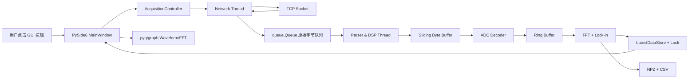
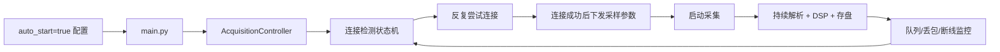

# PySide6 以太网 ADC 采集与实时处理软件架构计划

## Summary

本计划用于从 0 到 1 开发一款基于 `PySide6` 的跨平台（Windows/Linux）以太网数据采集与实时处理软件，目标硬件为 `SK2301` 16 通道 24 位 ADC，通讯协议为方控自定义 `FkPro over TCP`。

首版目标聚焦于“稳定采集 3 轴磁传感器微弱交流信号并实时处理”，默认启用 `CH0, CH1, CH2`，默认采样率按用户要求设为 `2000Hz`，默认量程假定设备已手动配置为 `±10V`，软件不主动改变量程。实时显示必须使用 `pyqtgraph`，禁止使用 `Matplotlib`。采集链路必须采用生产者-消费者模型，网络接收、协议解析/DSP、GUI 刷新严格解耦，避免数据积压导致崩溃。

用户已确认的关键决策：

- AUV 自动化模式采用“同一 GUI 入口，可隐藏/最小化窗口”的方式运行，不单独做纯 CLI 入口。
- 本地存盘首版采用 `NPZ + CSV`：波形/窗口数据用 `NPZ`，Lock-in 特征和运行状态摘要用 `CSV`。
- 数字锁相放大首版使用软件参考：按采样率生成 `50Hz` 的 `sin/cos` 本振，不依赖外部参考通道。

## Current State Analysis

当前仓库路径：`/Users/auv_user/coding/fangkong_adc`

当前仓库没有应用代码，只有参考文档：

- `参考文档/FKPro协议示例转写与校正.md`
- `参考文档/SK2301与FKPro技术契约总结.md`
- `参考文档/FKPro通讯协议及编程说明书_V1.2.pdf`
- `参考文档/SK2301一体化信号采集控制模块产品说明书_V2.0.pdf`
- `参考文档/MinerU_markdown_FKPro通讯协议及编程说明书_V1.2_2055862315048960000.md`
- `参考文档/MinerU_markdown_SK2301一体化信号采集控制模块产品说明书_V2.0_2055862219376885760.md`
- `参考文档/协议示例/*.png`

已从契约文档确认的协议事实：

- 默认 TCP 目标：`192.168.1.198:1600`
- 协议头：`46 4B 66 6B`，ASCII 为 `FKfk`
- 通用协议头长度：`16` 字节
- 所有字段大端序
- 以太网场景 `inst_addr = 0x0000`
- TCP 场景 `crc = 0x0000`
- 常规寄存器读：`0x7A01`
- 常规寄存器写：`0x7A10`
- 串行寄存器读：`0x7A02`
- 串行寄存器写：`0x7A20`
- 采样参数寄存器：`10-16`
- 启动采集寄存器：`17`
- 状态寄存器：`18`
- 波形数据串行寄存器：`19`
- 24 位采样样本布局：`高8bit + 中8bit + 低8bit + 通道号`
- 单次串行数据区最多 `1440` 字节
- `16` 通道、`24bit` 时每个时间点为 `64` 字节，`1440` 不能整除，首版建议读取 `1408` 字节以整帧对齐

## Proposed Directory Tree

计划新增如下工程结构：

```text
/Users/auv_user/coding/fangkong_adc/
├── README.md
├── requirements.txt
├── main.py
├── config/
│   ├── __init__.py
│   ├── default_config.yaml
│   ├── settings.py
│   └── config_manager.py
├── protocol/
│   ├── __init__.py
│   ├── constants.py
│   ├── frames.py
│   ├── stream_parser.py
│   └── adc_decoder.py
├── network/
│   ├── __init__.py
│   ├── tcp_client.py
│   ├── network_worker.py
│   └── reconnect_state.py
├── core/
│   ├── __init__.py
│   ├── acquisition_controller.py
│   ├── pipeline.py
│   ├── ring_buffer.py
│   ├── dsp.py
│   ├── lockin.py
│   ├── storage.py
│   └── models.py
├── gui/
│   ├── __init__.py
│   ├── main_window.py
│   ├── channel_panel.py
│   ├── plot_widgets.py
│   ├── control_panel.py
│   └── status_panel.py
├── tests/
│   ├── __init__.py
│   ├── test_protocol_frames.py
│   ├── test_stream_parser.py
│   ├── test_adc_decoder.py
│   └── test_dsp_lockin.py
└── data/
    ├── raw/
    └── features/
```

说明：

- `config/`：配置管理，负责 YAML 读写、默认值、启动模式、通道选择、网络参数、采样率和存盘参数。
- `protocol/`：纯协议层，只处理字节打包、拆包、滑动缓冲和 ADC 样本解码，不触碰 socket、线程和 GUI。
- `network/`：Socket 通讯层，负责连接、重连、收发字节流和网络线程，不做复杂解析和 DSP。
- `core/`：业务控制、生产者-消费者队列、环形缓冲、FFT、Lock-in、存盘和运行状态管理。
- `gui/`：PySide6 界面层，仅负责展示和用户交互，通过 controller 触发业务动作，不直接操作 socket 或协议细节。
- `tests/`：协议、粘包半包、ADC 解码、DSP/Lock-in 的可重复单元测试。
- `data/`：默认本地存盘目录；实际路径可由配置覆盖。

## Proposed Changes

### 1. `requirements.txt`

用途：声明跨平台运行依赖。

建议依赖：

- `PySide6`
- `pyqtgraph`
- `numpy`
- `scipy`
- `PyYAML`
- `pytest`

约束：

- 不加入 `matplotlib`
- 不在首版引入过重的数据库依赖
- 暂不强制 `h5py`，因为用户已确认首版用 `NPZ + CSV`

### 2. `main.py`

用途：应用入口。

职责：

- 加载 `config/default_config.yaml` 和用户配置
- 创建 `QApplication`
- 创建 `AcquisitionController`
- 创建 `MainWindow`
- 根据 `auto_start` 决定启动后行为

启动规则：

- `auto_start = false`：进入 Debug 交互模式，显示完整 GUI，等待用户点击“连接 -> 设参 -> 启动采集 -> 停止采集”。
- `auto_start = true`：进入 AUV 自动化模式，启动 GUI 但允许自动隐藏/最小化；后台状态机不断重试连接，连接成功后自动设参、启动采集、DSP 和存盘。

### 3. `config/default_config.yaml`

用途：默认配置文件，程序首次启动时加载。

计划字段：

```yaml
network:
  host: "192.168.1.198"
  port: 1600
  connect_timeout_sec: 3.0
  recv_timeout_sec: 1.0
  reconnect_interval_sec: 2.0

device:
  sample_rate_hz: 2000
  active_channels: [0, 1, 2]
  total_channels: 16
  adc_bits: 24
  voltage_range: "+/-10V"
  configure_voltage_range: false
  read_bytes_per_request: 1408

runtime:
  auto_start: false
  hide_window_on_auto_start: false
  ui_refresh_hz: 30

queue:
  raw_queue_max_chunks: 512
  raw_queue_drop_policy: "drop_oldest"
  parser_batch_chunks: 16
  warning_threshold_ratio: 0.8

dsp:
  fft_window_sec: 1.0
  fft_overlap: 0.5
  lockin_frequency_hz: 50.0
  lockin_window_sec: 1.0
  lockin_reference: "software"

storage:
  enabled: true
  root_dir: "data"
  raw_npz_enabled: true
  feature_csv_enabled: true
  flush_interval_sec: 5.0
```

关键约束：

- `sample_rate_hz` 默认必须是 `2000`，不是当前手工调试的 `10000`。
- `configure_voltage_range` 默认必须是 `false`，避免程序改写已手动配置好的 `±10V`。
- `active_channels` 默认 `[0, 1, 2]`。

### 4. `config/settings.py`

用途：定义配置数据结构。

计划类：

- `NetworkConfig`
- `DeviceConfig`
- `RuntimeConfig`
- `QueueConfig`
- `DspConfig`
- `StorageConfig`
- `AppConfig`

实现要求：

- 使用 `dataclasses`
- 加载后做合法性校验
- 通道必须在 `0-15`
- 采样率必须属于 SK2301 支持档位，首版默认 `2000`
- `read_bytes_per_request` 必须为 `active_channel_count * 4` 的整数倍，若读取 16 通道整帧则默认 `1408`

### 5. `config/config_manager.py`

用途：配置加载和保存。

职责：

- 从 `default_config.yaml` 加载默认配置
- 支持用户配置覆盖，后续可落到 `config/user_config.yaml`
- 提供 `load_config()`、`save_config()`、`validate_config()`

### 6. `protocol/constants.py`

用途：协议常量集中定义。

关键常量：

- `MAGIC = b"FKfk"`
- `HEADER_SIZE = 16`
- `CMD_READ_REG = 0x7A01`
- `CMD_WRITE_REG = 0x7A10`
- `CMD_READ_STREAM = 0x7A02`
- `CMD_WRITE_STREAM = 0x7A20`
- `REG_AD_MODE = 10`
- `REG_AD_START = 17`
- `REG_AD_STATUS = 18`
- `REG_AD_STREAM = 19`
- `MAX_STREAM_DATA_BYTES = 1440`

### 7. `protocol/frames.py`

用途：纯协议帧打包和基础响应解析。

计划函数/类：

- `FkProHeader`
- `build_read_registers(reg_addr: int, count: int) -> bytes`
- `build_write_registers(reg_addr: int, values: list[int]) -> bytes`
- `build_read_stream(reg_addr: int, byte_count: int) -> bytes`
- `parse_header(packet: bytes) -> FkProHeader`

约束：

- 必须使用 `struct.pack(">IHHHHH")` 或等价大端逻辑。
- 不允许在该模块里创建 socket。
- 不允许在该模块里引用 PySide6。

### 8. `protocol/stream_parser.py`

用途：处理 TCP 粘包/半包。

核心设计：

- 内部维护 `bytearray` 作为滑动缓冲区。
- 每次 `feed(data: bytes)` 只追加字节。
- `extract_packets()` 循环找 `FKfk` 报头。
- 找到报头后，先确认缓冲区至少有 `16` 字节。
- 从偏移 `10-11` 读取 `data_num`。
- 只有当缓冲区长度 `>= 16 + data_num` 时才截取完整包。
- 对头部前面的脏字节直接丢弃并计数。
- 半包留在缓冲区等待下一次 `feed()`。

必须避免的错误：

- 禁止 `sock.recv(1024)` 后立即 `struct.unpack()`。
- 禁止假设一次 `recv()` 等于一包。

### 9. `protocol/adc_decoder.py`

用途：将寄存器 `19` 返回的数据区解码为多通道电压数据。

职责：

- 解析 24 位样本布局：`high, mid, low, channel_id`
- 校验通道号轮转
- 将原始样本转为有符号值
- 按 `±10V` 量程换算为电压
- 输出形状为 `(n_samples, n_channels)` 的 `numpy.ndarray`

首版策略：

- 默认只向上游暴露激活通道 `[0,1,2]`
- 仍可校验全 16 通道帧的通道号是否连续
- 对异常通道号计数并上报状态，不在解析线程直接弹窗

注意：

- 契约文档中的公式使用 `V = 10.0 * Vhex / 0x80000000`。
- 因硬件将通道号放入第 4 字节，首版需在联调中确认 `Vhex` 应如何组合；计划实现时应保留原始 `raw24`、`channel_id` 和 `voltage`，便于校验。

### 10. `network/tcp_client.py`

用途：低层 TCP 客户端。

职责：

- `connect()`
- `close()`
- `send_all(data: bytes)`
- `recv_some(max_bytes: int) -> bytes`
- 超时和断开异常归一化

约束：

- 不做协议解析。
- 不做 DSP。
- 不更新 GUI。

### 11. `network/reconnect_state.py`

用途：连接状态机定义。

状态建议：

- `DISCONNECTED`
- `CONNECTING`
- `CONNECTED`
- `CONFIGURING`
- `ACQUIRING`
- `RECONNECT_WAIT`
- `STOPPING`
- `ERROR`

状态机行为：

- 断网/超时进入 `RECONNECT_WAIT`
- 等待 `reconnect_interval_sec`
- 自动回到 `CONNECTING`
- GUI 按钮只发出意图，不直接操纵 socket

### 12. `network/network_worker.py`

用途：生产者线程。

线程模型：

- 使用 `threading.Thread` 或 `QThread` 均可；首版建议使用 `threading.Thread`，与 `queue.Queue` 配合最直接。
- 该线程最高优先级任务是 `socket.recv()`。
- 收到原始字节后不做复杂解析，立即推入 `raw_queue`。

必须具备：

- `stop_event: threading.Event`
- `raw_queue: queue.Queue[bytes]`
- 队列满时执行 `drop_oldest`
- 队列长度达到阈值时上报 warning 状态
- 捕获 `socket.timeout`、`ConnectionError`、`OSError`

禁止：

- 禁止在该线程做 FFT、Lock-in、绘图。
- 禁止在该线程直接调用 GUI 控件。

### 13. `core/pipeline.py`

用途：消费者线程，即 Parser & DSP Thread。

职责：

- 从 `raw_queue` 批量取出字节块
- 调用 `SlidingByteBuffer.feed()`
- 批量提取完整 FkPro 包
- 对寄存器 `19` 的数据包调用 `adc_decoder`
- 将解码后的波形写入环形缓冲
- 执行 FFT 和 Lock-in
- 将最新 UI 快照写入线程安全的 `LatestDataStore`
- 将波形/特征交给 `storage`

线程模型：

- 使用 `threading.Thread`
- 使用 `threading.Lock` 保护共享快照
- 使用批量消费减少线程切换开销

必须避免：

- 禁止简单 `time.sleep()` 轮询作为主要同步机制。
- 可以使用短 timeout 的 `queue.get(timeout=...)`，但主驱动必须是队列消费。

### 14. `core/ring_buffer.py`

用途：保存最近一段时间的多通道波形。

设计：

- 使用预分配 `numpy.ndarray`
- 维度：`(capacity_samples, channel_count)`
- 写入时环形覆盖
- 读取 UI 窗口时返回拷贝，避免 GUI 与 DSP 线程竞争

默认容量：

- 至少保存最近 `10s` 数据
- 默认 `sample_rate_hz=2000`、`3` 通道时容量约 `20000 × 3`

### 15. `core/dsp.py`

用途：FFT 频谱分析。

职责：

- 窗函数处理
- `numpy.fft.rfft`
- 频率轴计算
- 对每个激活通道输出幅度谱

默认：

- FFT 窗口 `1s`
- `2000Hz` 采样率下每窗 `2000` 点
- UI 只展示有限频率范围，避免绘图负担过大

### 16. `core/lockin.py`

用途：数字锁相放大。

首版算法：

- 对每个激活通道取长度为 `lockin_window_sec` 的窗口
- 生成软件参考：
  - `ref_i = cos(2π * 50Hz * t)`
  - `ref_q = sin(2π * 50Hz * t)`
- 对信号与 `ref_i/ref_q` 做乘积积分或均值低通
- 输出：
  - `I`
  - `Q`
  - `amplitude = 2 * sqrt(I^2 + Q^2)`
  - `phase = atan2(Q, I)`

后续扩展：

- 可增加低通滤波器时间常数
- 可增加通道参考模式，但不作为首版默认

### 17. `core/storage.py`

用途：本地存盘。

首版策略：

- 原始或窗口波形：`data/raw/YYYYMMDD/session_xxx/*.npz`
- 特征摘要：`data/features/YYYYMMDD/session_xxx_lockin.csv`
- 状态事件：可追加 `session_xxx_events.csv`

NPZ 内容建议：

- `timestamp`
- `sample_rate_hz`
- `channels`
- `voltage`
- `raw_counts`（可选）

CSV 内容建议：

- `timestamp`
- `channel`
- `lockin_freq_hz`
- `amplitude`
- `phase_rad`
- `i_component`
- `q_component`
- `queue_size`
- `dropped_chunks`

### 18. `core/acquisition_controller.py`

用途：业务协调器，连接 GUI、网络和数据处理。

职责：

- 管理当前状态机
- 响应 GUI 的连接/设参/启动/停止请求
- 在 AUV 自动化模式下自动执行连接、设参和启动采集
- 持有 `raw_queue`、`network_worker`、`pipeline_worker`
- 向 GUI 提供线程安全快照接口

Debug 模式按钮行为：

- “连接”：启动连接状态机
- “设参”：下发采样率 `2000Hz`、通道选择等参数；不写量程寄存器
- “启动采集”：写启动寄存器 `17`
- “停止采集”：停止线程、关闭 socket、刷新状态

AUV 模式行为：

- 启动后自动进入连接循环
- 连接成功后自动配置采样率与通道
- 自动启动采集
- 持续解析、DSP、存盘
- 断线后自动回到重连流程

### 19. `gui/main_window.py`

用途：主窗口。

组成：

- 顶部状态栏：连接状态、采样率、队列长度、丢包数、当前模式
- 左侧控制区：Debug 按钮、配置加载/保存、通道选择
- 中央波形图：3 个默认通道曲线，可扩展显示更多通道
- 频谱图：FFT 幅度谱
- Lock-in 面板：50Hz 幅值、相位、I/Q

刷新机制：

- 使用 `QTimer`
- 默认 `30Hz`
- 主线程定时从 `AcquisitionController.get_latest_snapshot()` 拉取最新数据
- GUI 不直接订阅消费者线程的逐包事件，避免 UI 事件风暴

### 20. `gui/plot_widgets.py`

用途：封装 pyqtgraph 绘图。

要求：

- 必须使用 `pyqtgraph.PlotWidget`
- 使用 `setData()` 更新曲线
- 控制最大绘图点数，例如最近 `1-3s` 数据
- 禁止引入 `matplotlib.pyplot`

### 21. `tests/`

必须覆盖：

- FkPro 命令打包是否大端正确
- 粘包：两个完整包一次 feed
- 半包：分两次 feed 才返回完整包
- 脏字节：报头前有垃圾字节能恢复
- ADC 解码：构造 24 位样本并验证通道号
- Lock-in：合成 50Hz 正弦，验证幅值和相位
- 队列溢出策略：队列满时 drop oldest，不无限增长

## Core Data Flow

### Debug 交互模式



### AUV 自动化模式



### 线程边界

```text
主线程：
  QApplication + MainWindow + QTimer + pyqtgraph 刷新

生产者线程：
  socket.recv() -> raw_queue.put_nowait()

消费者线程：
  raw_queue.get/batch -> SlidingByteBuffer -> ADC decode -> RingBuffer -> FFT/Lock-in -> Snapshot/Storage
```

## 防数据积压方案

核心原则：网络接收优先，解析和绘图降频，内存有上限，积压可观测。

具体策略：

1. `NetworkWorker` 只做 `recv` 和入队，不做复杂解析。
2. `raw_queue` 设置固定最大长度，例如 `512` 个 chunk。
3. 入队时如果队列满，执行 `drop_oldest`：
   - 先 `get_nowait()` 丢弃最旧 chunk
   - 累加 `dropped_chunks`
   - 再放入最新 chunk
4. `PipelineWorker` 批量消费，例如每次最多取 `16` 个 chunk，降低锁竞争和线程切换。
5. `RingBuffer` 只保存最近窗口，旧数据环形覆盖，不无限增长。
6. GUI 使用 `QTimer` 以 `30Hz` 刷新，不按采样点或网络包刷新。
7. pyqtgraph 每次只画最近 `1-3s` 数据，不画全部历史。
8. 存盘采用缓冲批量 flush，默认每 `5s` 写一次，避免每包同步写磁盘。
9. 状态栏持续显示：
   - `raw_queue.qsize()`
   - `dropped_chunks`
   - `parse_errors`
   - `channel_mismatch_count`
   - `recv_rate_bytes_per_sec`
   - `dsp_latency_ms`
10. 当队列超过 `80%` 阈值时 GUI 显示黄色告警；发生丢包时显示红色告警，并写入事件 CSV。

禁止方案：

- 禁止以 `time.sleep()` 循环作为主数据处理机制。
- 禁止消费者线程直接更新 GUI。
- 禁止无界队列。
- 禁止每次收到数据都完整重画全部历史。

## TCP 粘包/半包处理方案

核心原则：TCP 是流，不是包。必须用滑动缓冲。

解析流程：

1. `NetworkWorker` 从 socket 得到任意长度 `bytes`，放入 `raw_queue`。
2. `PipelineWorker` 从 `raw_queue` 批量取出 chunk。
3. `SlidingByteBuffer.feed(chunk)` 追加到内部 `bytearray`。
4. `extract_packets()` 开始循环：
   - 查找 `FKfk`
   - 若找不到，保留最后 `3` 字节用于跨 chunk 匹配，其他丢弃并计数
   - 若找到但前面有脏字节，丢弃脏字节
   - 若缓冲区不足 `16` 字节，等待更多数据
   - 从 header 中读取 `data_num`
   - 计算 `packet_len = 16 + data_num`
   - 若缓冲区不足 `packet_len`，等待更多数据
   - 若足够，截取完整包并从缓冲区移除
5. 对完整包解析 header，按 `cmd_code/reg_addr` 分发：
   - `0x7A02 + reg_addr=19`：ADC 数据包
   - `0x7A01/0x7A10`：寄存器响应
   - 其他响应进入状态日志或后续扩展

异常处理：

- `data_num > 1440` 时视为异常包，丢弃当前报头并继续搜索下一个 `FKfk`。
- `protocol_code` 不匹配时滑动一字节继续搜索。
- 解析错误只影响当前包，不终止消费者线程。

## Robustness Design

### 连接检测状态机

状态流：

```text
DISCONNECTED
  -> CONNECTING
  -> CONNECTED
  -> CONFIGURING
  -> ACQUIRING
  -> RECONNECT_WAIT
  -> CONNECTING
```

触发条件：

- `connect()` 成功：`CONNECTING -> CONNECTED`
- 初始化读寄存器成功：`CONNECTED -> CONFIGURING`
- 采样参数下发成功：`CONFIGURING -> ACQUIRING`
- `recv` 返回空、超时过多、`OSError`：进入 `RECONNECT_WAIT`
- 用户点击停止：进入 `STOPPING -> DISCONNECTED`

GUI 要求：

- 所有网络动作都在后台线程执行，GUI 不能卡死。
- 状态变化通过 controller 的状态快照显示。

### 采集配置策略

首版下发：

- `Ad_Mode = 0`，实时传输模式
- `Ad_Fre_H/L = 2000`
- `Channel_En` 根据配置生成，默认 `[0, 1, 2]`
- `Ad_Filter_Type` 初始保守设为 `0`
- `参数设置使能 = 1`
- 启动采集寄存器 `17 = 1`

首版不下发：

- 不主动写 `Ad_Range` 改变量程，避免覆盖用户已手动配置的 `±10V`
- 不做网络参数修改
- 不做 RTC 修改
- 不做 TF 卡离线采集
- 不做 UDP 自动上传

注意：

- 现有截图中的连续写寄存器 `10-16` 包含 `Ad_Range` 字段；实现时需要谨慎处理“必须连续写 7 寄存器”和“不改变量程”的冲突。首版计划采用读取当前 `Ad_Range` 后原值回写，或提供协议层函数支持只写必要寄存器。如果设备不允许分散写，则使用“读当前量程 -> 按原值写回”的策略。

## Assumptions & Decisions

已确认决策：

- AUV 自动化模式：同一 GUI 入口，可隐藏/最小化。
- 存盘格式：`NPZ + CSV`。
- Lock-in 参考：软件 50Hz 参考。
- 采样率：默认 `2000Hz`。
- 量程：用户已手动配置 `±10V`，软件首版不主动修改。
- 默认通道：`CH0, CH1, CH2`。
- 实时绘图：必须使用 `pyqtgraph`。
- 队列模型：必须使用 `threading.Thread` 或 `QThread` 加 `queue.Queue`，首版建议 `threading.Thread + queue.Queue`。

计划内假设：

- 首版以 `FkPro over TCP` 主动读波形为唯一采集方式。
- 首版不实现 UDP 自动上传。
- 首版不实现 TF 卡离线采集。
- 首版不实现网络参数修改。
- 首版不支持纯 CLI 无头入口。
- 首版只保证 Windows/Linux；macOS 可用于开发验证但不作为目标交付平台。

## Implementation Phases

### Phase A：工程骨架与配置

新增：

- `requirements.txt`
- `main.py`
- `config/default_config.yaml`
- `config/settings.py`
- `config/config_manager.py`
- 空包初始化文件

验收：

- 可加载默认配置
- 可校验采样率、通道和队列参数
- `auto_start`、`active_channels`、`sample_rate_hz` 可从 YAML 修改

### Phase B：协议层

新增：

- `protocol/constants.py`
- `protocol/frames.py`
- `protocol/stream_parser.py`
- `protocol/adc_decoder.py`
- 协议单元测试

验收：

- 能生成读/写寄存器命令
- 能生成读串行寄存器 `19` 命令
- 能正确处理粘包、半包和脏字节
- 能解码构造的 24 位多通道样本

### Phase C：网络层与连接状态机

新增：

- `network/tcp_client.py`
- `network/reconnect_state.py`
- `network/network_worker.py`

验收：

- 连接失败不会卡 GUI
- 断线后进入重连等待
- 原始字节只入队，不做 DSP
- 队列满时 `drop_oldest`

### Phase D：核心数据管线与 DSP

新增：

- `core/models.py`
- `core/ring_buffer.py`
- `core/dsp.py`
- `core/lockin.py`
- `core/storage.py`
- `core/pipeline.py`

验收：

- 消费者线程可批量消费 `raw_queue`
- FFT 对合成信号频率峰值正确
- Lock-in 对 50Hz 合成信号输出稳定幅值和相位
- NPZ/CSV 可写入

### Phase E：采集控制器

新增：

- `core/acquisition_controller.py`

验收：

- Debug 模式可按按钮序列执行连接、设参、启动、停止
- AUV 模式 `auto_start=true` 可自动进入连接和采集流程
- 状态快照包含连接状态、队列、丢包、DSP 输出

### Phase F：GUI 与实时绘图

新增：

- `gui/main_window.py`
- `gui/control_panel.py`
- `gui/channel_panel.py`
- `gui/plot_widgets.py`
- `gui/status_panel.py`

验收：

- 使用 PySide6 创建主窗口
- 使用 pyqtgraph 显示波形和 FFT
- `QTimer` 以 `30Hz` 拉取快照刷新
- 默认勾选 `CH0, CH1, CH2`
- UI 线程不直接执行 socket 或 DSP

### Phase G：端到端联调与性能自查

验收：

- 连接真实设备或模拟 TCP 服务时，能完成基本采集链路
- 2kHz × 3 通道实时绘图不卡顿
- 队列不会无限增长
- 断网/超时能自动重连
- 运行期间可观察队列长度、丢包数、解析错误数

## Verification Steps

### 静态与单元测试

执行：

```bash
python -m pytest tests
```

必须通过：

- 协议帧大端打包测试
- 粘包/半包测试
- ADC 24 位解码测试
- FFT/Lock-in 合成信号测试
- 队列溢出丢弃策略测试

### 本地无硬件模拟测试

计划增加一个测试用模拟 TCP 服务或测试 fixture：

- 构造 `FKfk` 包
- 模拟半包发送
- 模拟粘包发送
- 模拟错误报头
- 模拟 3 通道/16 通道 24 位样本

验收：

- `SlidingByteBuffer` 能恢复完整包
- `PipelineWorker` 能输出最新波形和 Lock-in 结果

### GUI 验证

执行：

```bash
python main.py
```

验证：

- 主窗口出现
- 默认通道为 `CH0, CH1, CH2`
- 绘图库为 `pyqtgraph`
- 刷新由 `QTimer` 驱动
- 点击按钮不会冻结界面

### AUV 自动化模式验证

修改配置：

```yaml
runtime:
  auto_start: true
  hide_window_on_auto_start: true
```

验证：

- 启动后自动进入连接循环
- 连接失败时持续重试且 GUI 不冻结
- 连接成功后自动设参和启动采集
- 断线后自动回到重连流程

### 性能与积压验证

验证指标：

- `raw_queue.qsize()` 长期不持续上升
- 丢包策略触发时内存不无限增长
- 2kHz × 3 通道实时绘图稳定
- GUI 刷新维持 `30Hz` 左右
- 存盘不会阻塞解析线程

## Out of Scope for First Implementation

首版不做：

- Matplotlib 绘图
- UDP 自动上传协议解析
- TF 卡离线采集下载
- 网络参数修改
- RTC 修改
- 纯 CLI/headless 入口
- HDF5 存储
- 复杂插件系统
- 完整安装包打包

这些功能可以在主链路稳定后作为二期扩展。
