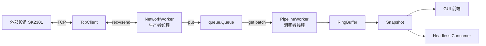
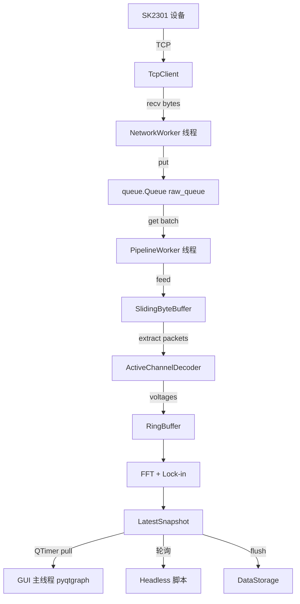
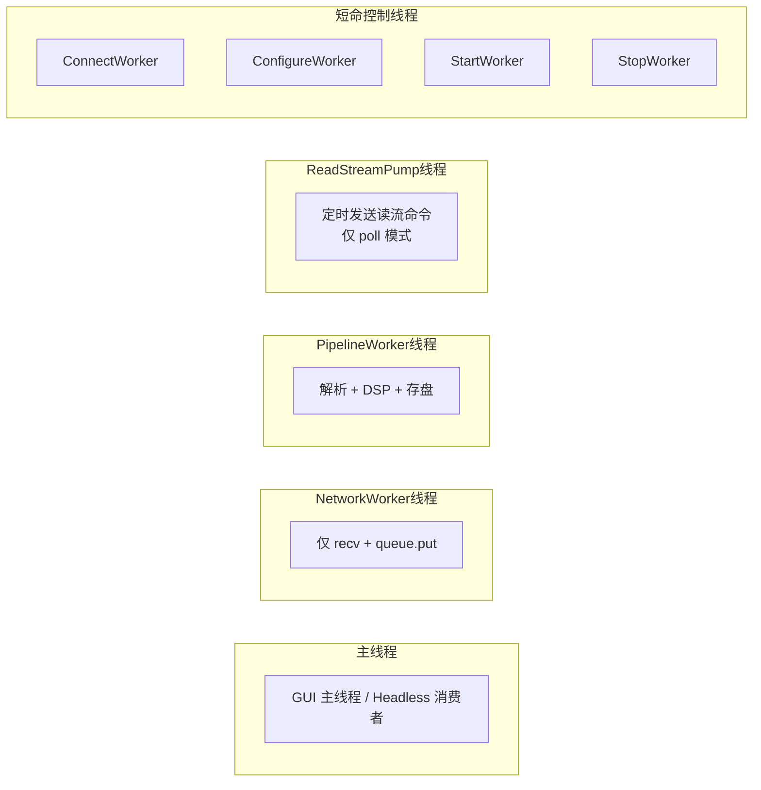

# SK2301 以太网 ADC 实时数据采集系统 — API 参考文档

---

## 1. 概述与架构

SK2301 以太网 ADC 实时数据采集系统是一套基于 TCP 协议与 SK2301 模块通信的多通道 24-bit ADC 采集软件，支持实时波形显示、FFT 频谱分析和 Lock-in 锁相放大，可在 GUI 模式和 Headless 模式下运行。

### 架构图



### 模块分层

| 层级 | 包 | 职责 |
|------|------|------|
| 配置层 | `config/` | 定义所有 dataclass 配置项、YAML 加载/合并/保存/校验 |
| 协议层 | `protocol/` | FkPro 帧构建与解析、TCP 粘包处理、ADC 样本解码 |
| 网络层 | `network/` | TCP 连接管理、生产者线程、连接状态枚举 |
| 核心层 | `core/` | 控制器门面、DSP 算法、Pipeline 消费者、RingBuffer、存储 |
| GUI 层 | `gui/` | PySide6 + pyqtgraph 显示前端（纯展示，不含业务逻辑） |

> **设计原则**：GUI 仅是显示前端，所有业务逻辑集中在非 GUI 模块中，可以 headless 使用。

---

## 2. 快速开始

### GUI 模式

```bash
python main.py
```

### Headless 模式

```bash
python headless.py --duration 10
```

### 作为 Python 模块使用

```python
from api import AcquisitionController, load_merged_config

config = load_merged_config("config/default_config.yaml")
controller = AcquisitionController(config)
controller._connect_impl()
controller._configure_impl()
controller._start_impl()

import time; time.sleep(5)

snapshot = controller.get_latest_snapshot()
print(f"采集样本数: {snapshot.waveform.shape[0]}")
print(f"Lock-in 结果: {snapshot.lockin}")

controller._stop_impl()
```

---

## 3. 配置系统

所有配置通过 Python `dataclass` 定义，支持从 YAML 文件加载与合并。

### AppConfig（顶层）

```python
@dataclass
class AppConfig:
    network: NetworkConfig
    device: DeviceConfig
    runtime: RuntimeConfig
    queue: QueueConfig
    dsp: DspConfig
    storage: StorageConfig
```

### NetworkConfig

| 字段 | 类型 | 默认值 | 含义 |
|------|------|--------|------|
| `host` | `str` | `"192.168.1.198"` | SK2301 设备 IP 地址 |
| `port` | `int` | `1600` | 设备 TCP 端口 |
| `connect_timeout_sec` | `float` | `3.0` | 连接超时（秒） |
| `recv_timeout_sec` | `float` | `1.0` | 接收超时（秒） |
| `reconnect_interval_sec` | `float` | `2.0` | 自动重连间隔（秒） |

### CalibrationConfig

| 字段 | 类型 | 默认值 | 含义 |
|------|------|--------|------|
| `enabled` | `bool` | `True` | 是否默认启用九参数标定 |
| `profile_path` | `str` | `"calibration_profiles/20260705T144937_magnetometer_9param.json"` | 默认九参数标定文件，相对路径按 submodule 根目录解析 |

### DeviceConfig

| 字段 | 类型 | 默认值 | 含义 |
|------|------|--------|------|
| `sample_rate_hz` | `int` | `2000` | ADC 采样率（Hz） |
| `active_channels` | `list[int]` | `[0, 1, 2]` | 激活通道列表 |
| `total_channels` | `int` | `16` | 设备总通道数 |
| `adc_bits` | `int` | `24` | ADC 位数 |
| `voltage_range` | `str` | `"+/-10V"` | 电压量程描述 |
| `configure_voltage_range` | `bool` | `False` | 是否在设参时写入量程寄存器 |
| `read_bytes_per_request` | `int` | `1404` | 每次读流请求的字节数 |
| `sensor_sensitivity_mv_per_ut` | `float` | `20.0` | 传感器灵敏度（mV/μT） |

### RuntimeConfig

| 字段 | 类型 | 默认值 | 含义 |
|------|------|--------|------|
| `auto_start` | `bool` | `False` | 是否启动后自动进入 AUV 循环 |
| `hide_window_on_auto_start` | `bool` | `False` | 自动启动时是否隐藏窗口 |
| `ui_refresh_hz` | `int` | `30` | GUI 刷新频率（Hz） |
| `transport_mode` | `str` | `"poll"` | 传输模式：`"poll"` 或 `"auto_upload"` |
| `scope_total_window_ms` | `int` | `200` | 示波器总时间窗口（ms） |
| `scope_div_ms` | `int` | `20` | 示波器每格时间（ms） |
| `waveform_y_unit` | `str` | `"voltage"` | 波形 Y 轴单位：`"voltage"` 或 `"magnetic_field"` |

### QueueConfig

| 字段 | 类型 | 默认值 | 含义 |
|------|------|--------|------|
| `raw_queue_max_chunks` | `int` | `512` | 原始队列最大 chunk 数 |
| `raw_queue_drop_policy` | `str` | `"drop_oldest"` | 队列满时的丢弃策略 |
| `parser_batch_chunks` | `int` | `16` | 消费者每次批量取 chunk 数 |
| `warning_threshold_ratio` | `float` | `0.8` | 队列积压告警阈值比例 |

### DspConfig

| 字段 | 类型 | 默认值 | 含义 |
|------|------|--------|------|
| `window_size_samples` | `int` | `4000` | DSP 窗口大小（样本数） |
| `hop_size_samples` | `int` | `200` | 窗口滑动步长（样本数） |
| `fft_window_sec` | `float` | `1.0` | FFT 窗口时长（秒） |
| `fft_overlap` | `float` | `0.5` | FFT 窗口重叠率 |
| `lockin_frequency_hz` | `float` | `50.0` | Lock-in 参考频率（Hz） |
| `lockin_window_sec` | `float` | `1.0` | Lock-in 窗口时长（秒） |
| `lockin_reference` | `str` | `"software"` | Lock-in 参考类型 |
| `packet_loss_fill_mode` | `str` | `"zero_order_hold"` | 丢包填充模式：`"zero_order_hold"` 或 `"zero_padding"` |

### StorageConfig

| 字段 | 类型 | 默认值 | 含义 |
|------|------|--------|------|
| `enabled` | `bool` | `True` | 是否启用存储 |
| `root_dir` | `str` | `"data"` | 存储根目录 |
| `raw_npz_enabled` | `bool` | `True` | 是否存储原始波形 npz |
| `feature_csv_enabled` | `bool` | `True` | 是否存储特征 CSV |
| `flush_interval_sec` | `float` | `5.0` | 落盘节流间隔（秒） |

### 配置加载函数

```python
def load_config(path: str | Path) -> AppConfig
```
从单个 YAML 文件加载配置，校验后返回 `AppConfig`。

```python
def load_merged_config(default_path: str | Path, user_path: str | Path | None = None) -> AppConfig
```
加载默认配置，若 `user_path` 存在则深度合并覆盖，校验后返回 `AppConfig`。

```python
def save_config(config: AppConfig, path: str | Path) -> None
```
校验配置后序列化为 YAML 并写入文件。

```python
def validate_config(config: AppConfig) -> None
```
校验配置合法性，不合法则抛出 `ValueError`。

---

## 4. AcquisitionController API（核心门面）

`AcquisitionController` 是对外唯一的门面类。所有操作（连接、设参、采集、停止、参数修改）都通过它完成。

**所在模块**：`core.acquisition_controller`

### 构造

```python
AcquisitionController(config: AppConfig)
```

创建控制器实例。初始化原始队列、环形缓冲区、TCP 客户端、存储引擎等内部组件。

### 生命周期方法

| 方法 | 说明 | 线程安全 |
|------|------|:--------:|
| `connect()` | 异步连接设备（非阻塞，内部开 ConnectWorker 线程） | 是 |
| `_connect_impl()` | 同步连接（阻塞直到完成或抛异常） | 否 |
| `configure_device()` | 异步配置设备（非阻塞，内部开 ConfigureWorker 线程） | 是 |
| `_configure_impl()` | 同步配置（阻塞） | 否 |
| `start_acquisition()` | 异步启动采集（非阻塞，内部开 StartWorker 线程） | 是 |
| `_start_impl()` | 同步启动（阻塞） | 否 |
| `stop_acquisition()` | 异步停止（非阻塞，内部开 StopWorker 线程） | 是 |
| `_stop_impl()` | 同步停止（阻塞） | 否 |
| `shutdown()` | 完整关闭（等价于 `stop_acquisition()`） | 是 |
| `start_auto_mode()` | 启动 AUV 自动化循环（连接→设参→采集→异常重连） | 是 |

### 状态查询

| 方法/属性 | 返回类型 | 说明 |
|-----------|----------|------|
| `get_latest_snapshot()` | `LatestSnapshot` | 获取最新数据快照（含波形、FFT、Lock-in、统计） |
| `state` | `ConnectionState` | 当前连接状态（属性） |

### 参数修改

| 方法 | 参数 | 说明 |
|------|------|------|
| `set_active_channels(channels: list[int])` | 通道列表 | 切换激活通道（非采集中才可调用） |
| `set_waveform_unit(unit_mode: str)` | `"voltage"` 或 `"magnetic_field"` | 切换波形 Y 轴单位 |
| `set_scope_timebase(total_window_ms: int, div_ms: int)` | 正整数 | 修改示波器时基并自动 resize RingBuffer |
| `save_user_config()` | — | 保存当前配置到 `config/user_config.yaml` |

---

## 5. 数据模型

### LatestSnapshot

实时数据快照，由 `PipelineWorker` 生产、由 GUI/Headless 消费。

| 字段 | 类型 | 说明 |
|------|------|------|
| `timestamp` | `float` | 快照时间戳（`time.time()`） |
| `state` | `ConnectionState` | 当前连接状态 |
| `channels` | `list[int]` | 激活通道列表 |
| `waveform` | `np.ndarray` shape `(N, C)` | 最新波形数据（电压，V） |
| `sample_rate_hz` | `int` | 采样率 |
| `fft` | `FftResult` | FFT 频谱结果 |
| `lockin` | `list[LockinResult]` | Lock-in 结果列表 |
| `queue_size` | `int` | 原始队列当前大小 |
| `stats` | `ProcessingStats` | 处理统计信息 |
| `status_message` | `str` | 状态提示消息 |
| `mode` | `str` | 运行模式描述 |
| `warning_message` | `str` | 告警消息（为空表示无告警） |

### LockinResult

单通道 Lock-in 解调结果。

| 字段 | 类型 | 说明 |
|------|------|------|
| `channel` | `int` | 通道号 |
| `frequency_hz` | `float` | 参考频率（Hz） |
| `amplitude` | `float` | 解调幅值 |
| `phase_rad` | `float` | 解调相位（rad） |
| `i_component` | `float` | 同相分量 I |
| `q_component` | `float` | 正交分量 Q |

### FftResult

FFT 频谱分析结果。

| 字段 | 类型 | 说明 |
|------|------|------|
| `freqs` | `np.ndarray` | 频率轴（Hz） |
| `spectra` | `dict[int, np.ndarray]` | 通道号 → 幅度谱 |

### ProcessingStats

采集与处理统计数据。

| 字段 | 类型 | 说明 |
|------|------|------|
| `packets` | `int` | 已解析包数 |
| `parse_errors` | `int` | 解析错误数 |
| `channel_mismatch_count` | `int` | 通道不匹配计数 |
| `dropped_chunks` | `int` | 丢弃 chunk 数 |
| `dsp_latency_ms` | `float` | DSP 处理延迟（ms） |
| `bytes_received` | `int` | 累计接收字节数 |
| `recv_rate_bytes_per_sec` | `float` | 实时接收速率（B/s） |
| `configured_sample_rate_hz` | `int` | 配置的采样率 |
| `packet_loss_count` | `int` | 协议级丢包计数 |
| `filled_sample_count` | `int` | 补点填充样本数 |

### ConnectionState（Enum）

```python
class ConnectionState(Enum):
    DISCONNECTED      # 未连接
    CONNECTING        # 连接中
    CONNECTED         # 已连接
    CONFIGURING       # 设参中
    ACQUIRING         # 采集中
    RECONNECT_WAIT    # 重连等待
    STOPPING          # 停止中
    ERROR             # 错误
```

---

## 6. DSP 算法

### compute_fft

```python
def compute_fft(samples: np.ndarray, sample_rate_hz: int, channels: list[int]) -> FftResult
```

**参数**：

| 参数 | 类型 | 说明 |
|------|------|------|
| `samples` | `np.ndarray` shape `(N, C)` | 多通道时域数据 |
| `sample_rate_hz` | `int` | 采样率 |
| `channels` | `list[int]` | 通道号列表（与 samples 列对应） |

**算法**：
1. 去除直流分量（减去均值）
2. 应用 Hanning 窗
3. 执行 `np.fft.rfft` 计算实数 FFT
4. 归一化：`|FFT| * 2 / (N * coherent_gain)`
5. 返回单边幅度谱

**返回**：`FftResult`，包含频率轴和各通道幅度谱。

---

### compute_lockin

```python
def compute_lockin(
    samples: np.ndarray,
    sample_rate_hz: int,
    channels: list[int],
    frequency_hz: float = 50.0,
) -> list[LockinResult]
```

**参数**：

| 参数 | 类型 | 说明 |
|------|------|------|
| `samples` | `np.ndarray` shape `(N, C)` | 多通道时域数据 |
| `sample_rate_hz` | `int` | 采样率 |
| `channels` | `list[int]` | 通道号列表 |
| `frequency_hz` | `float` | 参考频率，默认 50.0 Hz |

**算法**（软件参考锁相放大）：
1. 去除直流分量（减去均值）
2. 生成正交参考：`cos(2πft)` 和 `sin(2πft)`
3. 正交解调：`I = mean(y × cos)`，`Q = mean(y × sin)`
4. 幅值：`amplitude = 2 × √(I² + Q²)`
5. 相位：`phase = atan2(Q, I)`

**返回**：`list[LockinResult]`，每通道一个结果。

---

## 7. 协议层

### 帧构建

```python
def build_read_registers(reg_addr: int, count: int) -> bytes
```
构建读寄存器请求帧。`reg_addr` 和 `count` 均为 16-bit 无符号整数。

```python
def build_write_registers(reg_addr: int, values: list[int]) -> bytes
```
构建写寄存器请求帧。`values` 中每个值为 16-bit 无符号整数。

```python
def build_read_stream(reg_addr: int, byte_count: int) -> bytes
```
构建读流请求帧。`byte_count` 为请求的数据字节数。

```python
def build_write_stream(reg_addr: int, data: bytes) -> bytes
```
构建写流请求帧。`data` 为待写入的原始字节。

### 帧解析

```python
def parse_header(packet: bytes) -> FkProHeader
```
从数据包前 16 字节解析 FkPro 标准协议头。若数据不足则抛出 `ValueError`。

```python
def parse_upload_wave_header(packet: bytes) -> UploadWaveHeader
```
解析自动上传模式下的波形包头（48 字节）。

### FkProHeader

FkPro 标准协议头（16 字节）。

| 字段 | 类型 | 说明 |
|------|------|------|
| `magic` | `bytes` | 魔数（4 字节，`b'\x46\x4b\x50\x72'`） |
| `inst_addr` | `int` | 仪器地址 |
| `cmd_code` | `int` | 命令码 |
| `reg_addr` | `int` | 寄存器地址 |
| `data_num` | `int` | 数据数量 |
| `err_type` | `int` | 错误类型 |
| `crc` | `int` | CRC 校验 |

**属性**：
- `ok → bool`：魔数正确且无错误时为 `True`。

### UploadWaveHeader

自动上传模式波形包头（48 字节），包含协议版本、采样率、通道使能掩码、时间戳等。

**属性**：
- `ok → bool`：魔数正确且无错误时为 `True`。

### SlidingByteBuffer

TCP 粘包/半包滑动缓冲区。负责从连续 TCP 字节流中切分出完整协议包。

```python
def __init__(self, max_data_num: int = 1440, packet_mode: str = "poll")
```
- `max_data_num`：单包最大数据字节数
- `packet_mode`：`"poll"` 或 `"auto_upload"`，决定解析策略

```python
def feed(self, data: bytes) -> None
```
向缓冲区追加新数据。

```python
def extract_packets(self) -> list[bytes]
```
从缓冲区中提取所有完整包。不完整的数据保留待下次 `feed`。

### ActiveChannelDecoder

按激活通道序列重组跨包 ADC 样本。解决非 16 通道模式下按通道轮转的对齐问题。

```python
def __init__(self, active_channels: list[int], voltage_range: float = 10.0)
```
- `active_channels`：激活通道列表（有序）
- `voltage_range`：电压满量程（V）

```python
def decode(self, payload: bytes) -> DecodedAdcData
```
解码 payload 中的 ADC 样本。内部维护跨包状态，支持样本跨越多个 TCP 包。

### DecodedAdcData

解码结果数据结构。

| 字段 | 类型 | 说明 |
|------|------|------|
| `voltages` | `np.ndarray` shape `(N, C)` | 电压矩阵 |
| `raw24` | `np.ndarray` shape `(N, C)` | 24-bit 原始有符号值 |
| `channel_ids` | `np.ndarray` shape `(N, C)` | 通道 ID 矩阵 |
| `channels` | `list[int]` | 激活通道列表 |
| `stats` | `DecodeStats` | 解码统计 |

### DecodeStats

| 字段 | 类型 | 说明 |
|------|------|------|
| `samples_total` | `int` | 总样本数 |
| `channel_mismatch_count` | `int` | 通道不匹配计数 |
| `truncated_bytes` | `int` | 截断字节数 |

### decode_24bit_samples（legacy，16 通道模式）

```python
def decode_24bit_samples(
    payload: bytes,
    active_channels: list[int],
    total_channels: int = 16,
    voltage_range: float = 10.0,
) -> DecodedAdcData
```

Legacy 解码函数，假设全部 16 通道数据按序排列，从中提取激活通道。不维护跨包状态。

---

## 8. 网络层

### TcpEndpoint

```python
@dataclass
class TcpEndpoint:
    host: str
    port: int
```

TCP 连接目标地址。

### TcpClient

TCP 客户端，封装 `socket` 操作。

```python
def __init__(self, endpoint: TcpEndpoint, connect_timeout: float, recv_timeout: float)
```

| 方法 | 说明 |
|------|------|
| `connect() → None` | 连接到目标设备。失败抛出 `TcpClientError` |
| `send_all(data: bytes) → None` | 发送全部数据。失败抛出 `TcpClientError` |
| `recv_some(max_bytes: int = 4096) → bytes` | 接收数据（非阻塞超时返回空 bytes）。连接断开抛出 `TcpClientError` |
| `close() → None` | 关闭连接 |

**属性**：
- `connected → bool`：当前是否已建立连接。

### TcpClientError

```python
class TcpClientError(RuntimeError):
    pass
```

自定义异常，所有 TCP 错误统一抛出此类型。

### NetworkWorker(threading.Thread)

生产者线程，仅负责 `socket.recv()` 并推入 `queue.Queue`。队列满时执行 `drop_oldest` 策略。

```python
def __init__(
    self,
    client: TcpClient,
    raw_queue: queue.Queue[bytes],
    stop_event: threading.Event,
    stats: NetworkWorkerStats | None = None,
    on_error: Callable[[Exception], None] | None = None,
    recv_size: int = 4096,
)
```

| 参数 | 说明 |
|------|------|
| `client` | TCP 客户端实例 |
| `raw_queue` | 原始字节队列 |
| `stop_event` | 停止信号 |
| `stats` | 统计数据对象（可选） |
| `on_error` | 错误回调（可选） |
| `recv_size` | 每次 recv 的最大字节数 |

### NetworkWorkerStats

```python
@dataclass
class NetworkWorkerStats:
    bytes_received: int = 0
    chunks_received: int = 0
    dropped_chunks: int = 0
    last_error: str = ""
    last_recv_monotonic: float = 0.0
```

---

## 9. 存储层

### DataStorage

数据持久化引擎，负责波形 npz 存储和 Lock-in 特征 CSV 记录。

```python
def __init__(self, config: StorageConfig)
```

| 方法 | 说明 |
|------|------|
| `ensure_dirs() → None` | 确保输出目录存在 |
| `maybe_write_snapshot(snapshot: LatestSnapshot) → None` | 受 `flush_interval_sec` 节流的落盘入口 |
| `write_npz(snapshot: LatestSnapshot) → None` | 写入波形 npz 文件 |
| `append_lockin(snapshot: LatestSnapshot) → None` | 追加 Lock-in 结果到 CSV |
| `append_event(message: str) → None` | 追加事件日志到 events.csv |

**输出目录结构**：

```
data/
├── raw/YYYYMMDD/session_HHMMSS/
│   └── waveform_<timestamp_ms>.npz
└── features/YYYYMMDD/session_HHMMSS/
    ├── lockin.csv
    └── events.csv
```

### RingBuffer

线程安全环形缓冲区，用于存储最新 N 个样本供 DSP 和 GUI 消费。

```python
def __init__(self, capacity_samples: int, channel_count: int)
```

| 方法/属性 | 说明 |
|-----------|------|
| `append(samples: np.ndarray) → None` | 追加样本，shape 须为 `(n, channel_count)` |
| `latest(count: int | None = None) → np.ndarray` | 获取最新 `count` 个样本（默认全部） |
| `latest_window(window_size: int) → np.ndarray` | 获取最新 `window_size` 个样本 |
| `resize(new_capacity_samples: int) → None` | 动态调整容量，保留已有数据 |
| `size → int`（属性） | 当前已存储样本数 |

---

## 10. 线程模型与数据流

### 完整数据流



### 线程分布



### 线程职责说明

| 线程 | 生命周期 | 职责 |
|------|----------|------|
| **主线程** | 全程 | GUI 事件循环（QTimer 定时拉取 Snapshot）或 Headless 轮询 |
| **NetworkWorker** | 采集期间 | 仅执行 `socket.recv()` 并 `queue.put`，队列满时 drop_oldest |
| **PipelineWorker** | 采集期间 | 从队列批量取 chunk → SlidingByteBuffer 切包 → ActiveChannelDecoder 解码 → RingBuffer 追加 → DSP 计算 → 更新 Snapshot → 落盘 |
| **ReadStreamPump** | 采集期间（poll 模式） | 按采样率计算间隔，定时发送 `build_read_stream` 命令 |
| **ConnectWorker** | 短命 | 执行 `_connect_impl()`，完成后线程退出 |
| **ConfigureWorker** | 短命 | 执行 `_configure_impl()`，完成后线程退出 |
| **StartWorker** | 短命 | 执行 `_start_impl()`，完成后线程退出 |
| **StopWorker** | 短命 | 执行 `_stop_impl()`，完成后线程退出 |

---

*文档生成时间：2026-05-22*
